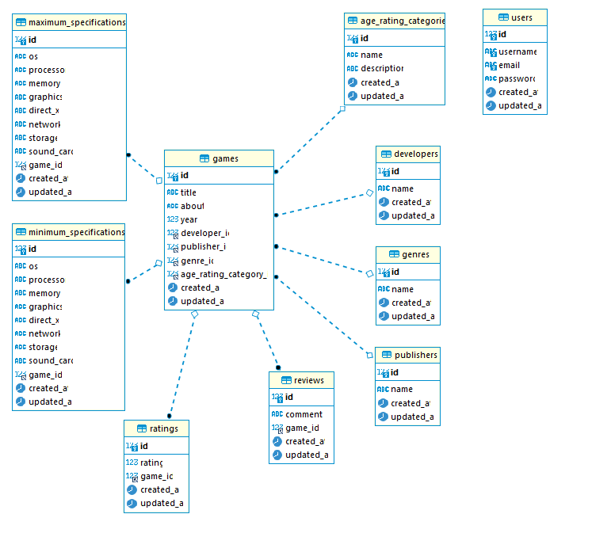
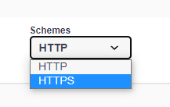
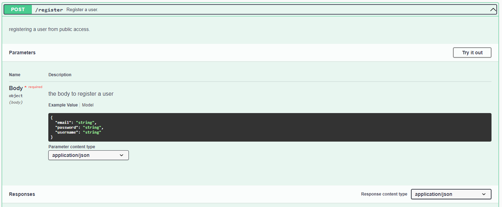
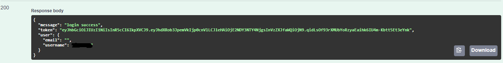
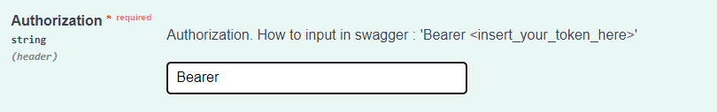

# Benchmark Steam API

Building Steam RESTAPI using Gin, Gorm and Swaggo

```
https://github.com/gin-gonic/gin
https://gorm.io/
https://github.com/swaggo
```

## Database Schema
Using MySQL




## Heroku Link
https://steam-benchmark-golang-api.herokuapp.com/swagger/index.html


## How To Use It
**1. Change schemes to HTTPS**




**2. Register your account**




**3. Login and get the token**




**4. For Post, Patch and Delete method you need to insert token (Type "Bearer" first and then insert your token inside authorization box)**



